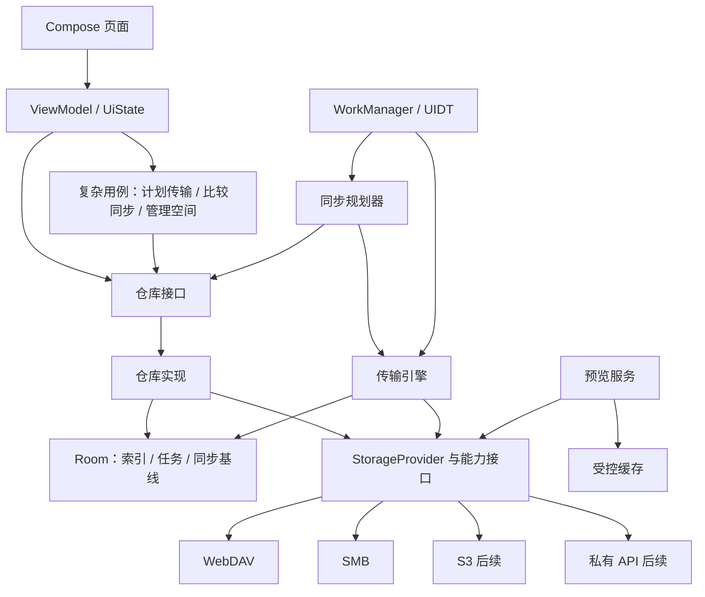

# 02 Android 架构

## 技术决策

采用 Kotlin 原生 Android、单 Activity、Jetpack Compose + Material 3、自适应布局。Google 当前已明确 Compose-first，架构指南推荐 Compose、单向数据流、仓库和生命周期感知状态收集，并推荐 Navigation 3。这里选择原生 Android，不引入跨平台 UI，也不为尚未提出的多平台需求增加抽象。[Compose-first](https://developer.android.com/develop/ui/compose/first)、[架构建议](https://developer.android.com/topic/architecture/recommendations)

| 领域 | 选择 | 本项目理由 |
| --- | --- | --- |
| UI | Compose、Material 3 稳定 API | 状态复杂，适合明确展示加载、部分成功、冲突和后台等待 |
| 导航 | Navigation 3，类型化目的地 | 自主管理返回栈、列表/详情和进程恢复 |
| 状态 | ViewModel + StateFlow，`collectAsStateWithLifecycle` | UI 订阅不可变状态；输入事件转换为新状态 |
| 异步 | Coroutines、Flow、结构化并发 | 统一取消、超时、背压；阻塞协议调用放到受限 IO 调度器 |
| 依赖注入 | Hilt + KSP | 统一 Activity、ViewModel、Worker、JobService 的依赖装配 |
| 数据库 | 新建工程首选 Room 3 稳定版 | 存元数据索引、任务和同步基线；Kotlin/KSP 协程契合新项目 |
| 设置 | DataStore | UI 偏好和小型配置；不是密码保险箱 |
| 持久后台 | WorkManager + JobScheduler UIDT | 自动备份和手动大文件任务分别调度，共享传输引擎 |
| HTTP | OkHttp；私有 JSON 使用 kotlinx.serialization，必要时 Retrofit | WebDAV 方法/流控制直接封装；不强制所有协议经过 HTTP |
| 图片 | Coil 3 候选 | 自定义远端数据源；缓存与加密策略可控，接入前验证维护状态和兼容性 |
| 音视频 | Media3 / ExoPlayer | 为统一读取接口提供 `DataSource` 桥接 |
| PDF | 初版平台 PdfRenderer + Compose 页面壳 | 有界下载后使用可 seek 文件描述符；Jetpack PDF 稳定性另行评估 |
| 凭据 | Android Keystore 包装的 AEAD 密文 | 本地凭据与远端 E2EE 密钥职责分开 |

Room 3 使用 `androidx.room3` 新包和 artifact，要求 KSP，异步 DAO 使用协程。不能混用旧 `androidx.room` 示例。若 M0 发现必需集成不兼容，可以通过 ADR 固定到 Room 2 稳定线；数据库模块外不暴露 Room 类型。[Room 3](https://developer.android.com/jetpack/androidx/releases/room3)、[迁移差异](https://developer.android.com/training/data-storage/room/migration-2-to-3)

Hilt 的具体版本需与 AGP 内置 Kotlin、KSP 一起锁定，不能直接照抄文档中的示例版本。[Hilt](https://developer.android.com/training/dependency-injection/hilt-android)

Coil 提供下采样、缓存和 Compose 集成，适合在受控数据源上构建图片预览；平台 PDF 渲染需要可 seek 的文件描述符，因此初版采用受限临时文件方案。[Coil](https://coil-kt.github.io/coil/)、[PdfRenderer](https://developer.android.com/reference/android/graphics/pdf/PdfRenderer)

## 分层与数据流

图中表示调用关系；编译依赖通过接口反转。UI 不引用协议 SDK、DAO、网络客户端或 WorkManager。普通查询直接访问仓库，只有跨仓库事务编排和可复用的复杂规则才引入 UseCase，避免为每个 getter 增加一层。

本地数据库是 UI 已知状态和任务状态的唯一事实来源；远端仍是远端文件内容的权威来源。界面先显示缓存再刷新，展示缓存时间。不能把“数据库里有条目”解释成远端文件仍存在。

文件操作流程：用户意图 → 持久化操作计划 → 调度 → 执行 → 远端验证 → 持久化结果 → UI 更新。目录刷新只在完整一轮成功后替换该轮快照；失败或未分页完成时不清空旧目录。

## 渐进模块化

首阶段建议 8 个 Gradle 模块；模块内部先用 package 分功能，避免刚开始创建几十个空模块。

| 初始模块 | 内容 | 允许依赖 |
| --- | --- | --- |
| `:app` | Activity、导航装配、Hilt 绑定、系统服务入口、暂存 feature 包 | 各公开模块 API，作为 composition root 可装配实现 |
| `:core:model` | 不含 Android 类型的 ID、版本、条目、错误、能力模型 | Kotlin 基础库 |
| `:core:storage-api` | Provider、读句柄、可选能力接口、契约值类型 | model、Coroutines、选定流抽象 |
| `:core:data` | 仓库 API/实现（分 package）、Room、DataStore、Android URI 来源 | model、storage-api |
| `:core:security` | CredentialStore、Keystore、缓存加密入口、锁定状态 | model，不依赖协议实现 |
| `:core:transfer` | 任务状态机、同步规划 package、执行器、调度适配 | model、storage-api、data 的公开接口、security API |
| `:protocol:webdav` | WebDAV SDK/HTTP 细节 | storage-api、model |
| `:protocol:smb` | SMB SDK/连接池/文件句柄 | storage-api、model |

协议会话通过工厂接收生命周期受控的凭据访问器，不直接访问 Keystore 或 Room。`core:data` 的实现通过注册表调用协议，注册表由 app 装配，因此 data 不直接依赖协议模块。

协议数量增加时新增 `:protocol:s3`、`:protocol:privatecloud`。界面复杂后拆 `:feature:connections`、`:feature:browser`、`:feature:preview`、`:feature:transfers`、`:feature:backup`、`:core:designsystem`；同步/加密逻辑增长后拆 `:core:sync`、`:core:crypto`。data 的公开 API 如需要严格编译隔离再拆成 `:core:data-api`，不以物理模块数作为架构质量指标。

feature 之间不互相依赖，通过类型化导航请求连接；所有协议实现只依赖公共契约，不能依赖 feature 或某个具体 Worker。

## 数据模型和持久化

| 实体 | 关键字段 | 一致性约束 |
| --- | --- | --- |
| Connection | id、type、displayName、endpointConfig、credentialRef、configRevision | 密码不入配置；任务固定账号与配置版本，改服务器需重新计划 |
| EntryCache | connectionId、opaqueId、parentId、displayName、kind、size?、mtime?、revision?、lastSeenEpoch | 唯一键为连接与不透明标识；目录不是路径字符串拼接 |
| ListingEpoch | parent、sort、cursor、startedAt、completedAt、coverage | 不完整列表不能推断删除 |
| TransferTask | taskId、operationId、source、destination、state、reason、attempt、leaseOwner、leaseExpiry | 幂等 ID、条件领取、依赖关系和最终结果持久化 |
| TransferCheckpoint | taskId、uploadSession、confirmedParts/offset、sourceRevision、destPrecondition、formatVersion | 只记录远端确认的进度；敏感会话字段加密 |
| SyncRule | 来源授权、目标、模式、网络/电源条件、过滤器、配置版本 | 一条规则固定作用域；检查重叠规则和反馈循环 |
| SyncBaseline | ruleId、logicalItemId、localVersion、remoteRevision、lastVerifiedDigest、remoteId | 只有完成提交并验证后才前移 |
| LocalMediaIndex | volume、MediaStoreVersion、mediaId、generation、uri、size、mtime | volume/version 变化导致重新核对，不把 ID 当永久身份 |
| Conflict | ruleId、基线、两端快照、原因、决议 | 决议生效前再次检查版本 |
| OfflineEntry | entryVersion、cacheRef、pin、verifiedAt、size | 离线 pin 独立于可淘汰缓存 |
| VaultState（后续） | vaultId、formatVersion、wrappedKeyRef、lockState | 密钥明文不进普通数据库/状态流 |

目录索引建立 `(connectionId, parentId, sortKey, opaqueId)` 索引。任务建立状态/下次尝试时间索引。持久化和执行之间使用事务性 outbox；Worker 输入只传任务 ID，不塞文件列表、token 或大 JSON。

已知字段允许 unknown，不能用 0 表示未知文件大小，也不以缺失 mtime 表示从未修改。byte offset、文件大小和进度使用 64 位整数。

## UI 状态与进程恢复

每个屏幕公开不可变 `UiState`，例如 `items / refreshState / coverage / selection / pendingOperations / banner`。初次错误、缓存可用但刷新失败、空目录是三种状态。

导航参数只存连接 ID、条目 ID、预览类型等小值；密码、签名 URL、图片字节、目录全集不进入返回栈和 SavedStateHandle。选中项以 ID 表示；目录巨大时“全选”默认只指已加载项，完整目录批处理需要明确建计划。

浏览/预览的请求跟随屏幕生命周期取消；持久任务不能挂在 ViewModel scope 下。长生命周期连接由受限会话池管理，监听账号登出、网络切换和空闲超时；取消必须关闭协议句柄或 HTTP call，并透传 CancellationException。

## 预览架构

统一读取句柄表达顺序读取、可重开范围读取以及版本条件；不要求每个服务提供 HTTP URL。SMB 可以按偏移读，HTTP 服务可验证 Range 返回，私有加密服务可增加认证解密层。

音视频路径：Media3 → 自定义 DataSource → 受限块缓存 → 可选解密层 → StorageProvider。位置以“解密后的文件偏移”表示，加密层负责映射密文偏移。Media3 支持自定义底层数据源，不能把 `smb://` 当作默认 HTTP 数据源使用。[DataSource 扩展入口](https://developer.android.com/reference/androidx/media3/datasource/DefaultDataSource)

| 类型 | 首版处理 | 边界 |
| --- | --- | --- |
| 图片 | 下采样缩略图、全屏缩放、按需原图 | 控制解码像素预算，异常图片失败可重试；不扫描全 NAS 生成缩略图 |
| 视频/音频 | 流式读取、可用时 seek | 容器/编码和设备能力共同决定；无 Range 时提示缓存后播放 |
| PDF | 下载到有配额的临时文件，再按页渲染 | 检查可用空间和文件大小，失败可外部打开；不要直接把不可 seek 流交给 PdfRenderer |
| 文本 | 初版最多载入前 1 MiB，可另行打开完整文件 | 编码选择、显示截断状态，HTML 按文本；不执行远端脚本 |
| Office / 其他 | 下载后使用系统打开方式 | 分享 `content://` 临时读权限，传出明文前说明 |

远端 HTTP 签名 URL 只保留短期内存引用，不作为缓存 key。缓存 key 使用账号、连接、条目版本、缩略图参数、加密空间和格式版本；账号切换、加密锁定、权限撤销必须隔离或清理相应缓存。

## 缓存和磁盘预算

普通可清理缓存、用户明确离线文件、进行中的上传暂存数据分开管理。建议图片/预览缓存总额初值 512 MiB、保留磁盘余量 `max(1 GiB, 总容量的 5%)`，这些是可调试的初始值。活动上传 checkpoint 依赖的数据不得被通用 LRU 清理。

E2EE 密文允许磁盘缓存；明文缩略图、文件名索引及预览临时文件按 05 的策略处理。普通 Room 数据库本身不自动加密。上传准备需要大体积暂存时先预算空间；不能在没有告知的情况下把整部 20 GiB 视频复制到 cache。

## 构建和版本策略

现有 AGP 9.4.0 / Gradle 9.6.0 / API 37 符合官方兼容表；AGP 要求的最低 JDK 为 17。Gradle daemon 25 是当前工程事实，不等于应用必须使用 Java 25 API。[AGP 9.4 兼容表](https://developer.android.com/build/releases/agp-9-4-0-release-notes)

AGP 9+ 自带 Kotlin 支持，不机械添加 `org.jetbrains.kotlin.android`。Compose compiler 插件和 KSP 按实际 Kotlin 编译器兼容关系固定；使用 Compose BOM 管理 Compose 库，BOM 不管理 Kotlin、KSP、Hilt 和全部 Jetpack 版本。[内置 Kotlin](https://developer.android.com/build/migrate-to-built-in-kotlin)、[Compose BOM](https://developer.android.com/develop/ui/compose/bom)

全部直接依赖写入 version catalog；不用 `+` 动态版本；启用依赖校验和 schema 导出。先以 debug / release 的真实构建验证新工具链，再启用 release 收缩并检查协议库反射/服务发现和加密 provider。设计阶段不先修改这些设置。
