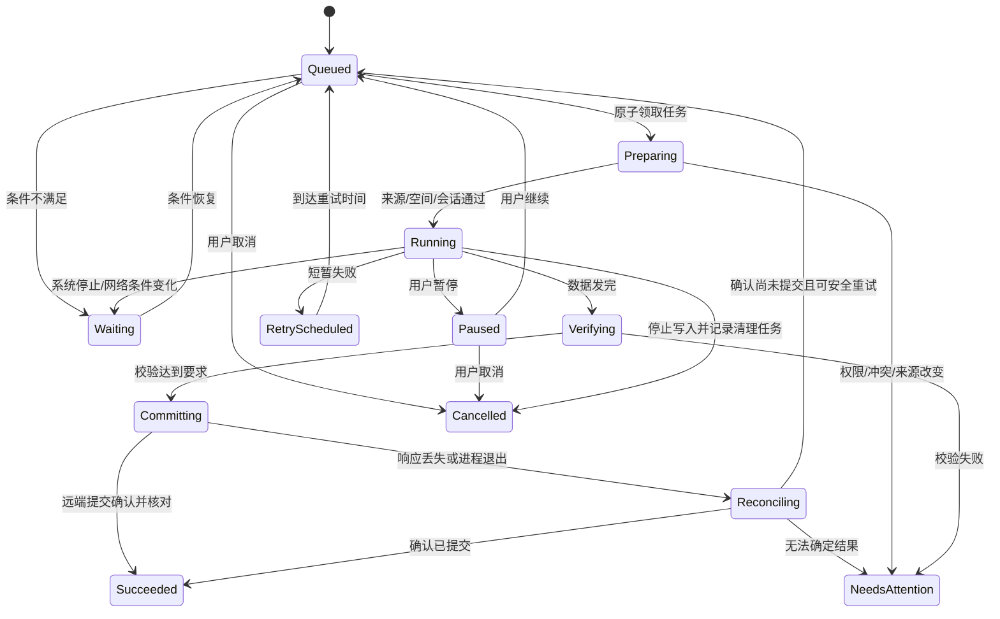

# 04 传输、自动备份与同步

## 调度和执行分离

数据库保存任务计划和进度，TransferEngine 执行有限工作，Android 调度器只决定何时调用它。同一任务可以由不同调度入口恢复，但同一时刻只能被一个执行者领取。

| 情况 | 调度方式 | 约束 |
| --- | --- | --- |
| 页面中的浏览、缩略图、预览 | 生命周期 scope 内协程 | 页面离开取消，不能承担持久备份 |
| 自动发现媒体、少量备份、核对状态 | WorkManager | 可延后、可停止、分批且可恢复 |
| 用户当前主动点击上传/下载的大任务 | JobScheduler UIDT（API 34+；本项目 min 35） | 在满足用户可见启动条件时提交，显示通知和进度 |
| 已有自动队列，用户点击“立即备份” | 合格的当前用户动作可新建 UIDT 执行请求 | 只接管同一队列中的任务，不重复创建文件操作 |
| 超长自动传输且协议不支持续传 | 先验证可在单次预算内完成；否则等待用户主动执行/换用支持续传的服务 | 不把自动任务伪装为用户操作 |

这是依据任务性质的选择。WorkManager 适合可中断的自动工作；UIDT 用于真实用户发起、需要展示持续进度的数据传输。[后台传输选择](https://developer.android.com/develop/background-work/background-tasks/data-transfer-options)、[UIDT](https://developer.android.com/develop/background-work/background-tasks/uidt)

不使用永久 dataSync 前台服务保活：Android 15+ 有时长限制，Android 16+ 长运行 Worker 还可能消耗 job 配额。前台服务只在确有适用场景时单独设计，不能更换 service type 来逃避限制。[FGS 超时](https://developer.android.com/develop/background-work/services/fgs/timeout)、[长运行 Worker](https://developer.android.com/develop/background-work/background-tasks/persistent/how-to/long-running)

## 任务状态机

状态图展示主要转移；Preparing、Verifying、Reconciling 也要响应取消/系统停止。Committing 期间收到取消不能假定回滚成功，应先核对远端结果，显示“文件已完成，取消未能撤回”或“结果待确认”。批量任务按子任务统计成功/失败，不用一个 100% 掩盖部分失败。

Waiting 携带可展示原因：Network、Unmetered、WiFi、Charging、Battery、Storage、UserUnlock、OsScheduling。NeedsAttention 携带 Auth、Permission、Conflict、UnknownCommit、UnsupportedResume 等明确类别。

## 领取、幂等和恢复

1. 用户动作或扫描发现文件后，在一个 Room 事务里创建操作、来源快照与 outbox；生成稳定 operationId。
2. 调度器根据任务 ID 原子领取 lease；领取时校验规则版本、账号配置和目标范围。不能只靠 WorkManager unique work 防止与 UIDT 重复执行。
3. 获取 URI 访问权并核对来源版本；必要时等待媒体写入完成。已更改来源对应新一代操作。
4. 恢复已有远端会话，先 reconcile 远端已确认分片/偏移，避免凭本地已发送字节盲目推进。
5. 在有界缓冲下传输，按分片确认/检查点持久化；网络回调与通知进度限频，约 2–4 次/秒即可。
6. 完成服务端提交与必要的完整性验证，再原子更新任务结果与同步基线。
7. 进程重启后核对过期 lease、未知提交和待清理数据。调度 API 调用失败由 outbox 重试；远端已成功而本地没记账时进入 reconcile。

任务使用“至少一次尝试 + 幂等或可核对的效果”，不宣称网络环境中天然 exactly-once。lease 带递增 generation；执行者续租，写结果时做 CAS。每个运行中的执行者在副作用前检查持有权；服务端有条件提交/锁时利用它们，没有时使用独占临时对象和不覆盖目标的策略。不能只依赖过期本地 lease 解决远端竞争。

进程退出回调可能不执行；checkpoint 必须在工作过程中落盘。系统强制停止后，不承诺自动复活；用户再次打开时核对任务并恢复。用户明确暂停的任务不由扫描器自动解除暂停。

## 上传的正确性

校验状态区分：服务已确认接收 / 长度已核对 / 内容摘要已验证 / 加密认证已验证。UI 不把这些统一说成“已做完整内容校验”。

若服务提供可信且算法/覆盖范围匹配的内容摘要，则与本机流式计算结果比较。S3 multipart ETag 不是通用内容摘要；WebDAV ETag 也主要用来辨别版本。只有长度时标记较低验证等级，允许用户运行回读校验；未来释放本机空间须另行满足严格校验门槛。

支持临时对象的后端优先 `唯一临时名称 → 写入 → 验证 → 条件提交`。无原子提交能力时不做未经保护的覆盖；默认另存，或让用户显式处理冲突。临时对象清理保留 taskId、归属与租约信息，不能按文件扩展名批量删除不属于本应用的数据。

WebDAV 不支持续传时，中断任务显示“需要从头上传”。大文件长时间超过自动运行预算时转为“需手动开始长任务”，不能无限重试到消耗电池。SMB 偏移写入和 S3 multipart 也必须验证实际恢复语义，不仅仅检查 API 名称。

暂停保留可恢复会话；取消停止传输并异步清理未提交数据；完成后撤销是另一个显式操作。远端不可达导致清理失败时保留清理记录，后来只清理已确认属于任务的残留。

## 自动发现本机照片/视频

手动上传优先 Photo Picker；持续备份使用 MediaStore 获得用户授予的媒体范围；普通文件夹使用 SAF 的持久 URI 授权。Picker 选一次文件不等于获得未来所有照片的自动访问权。[Photo Picker](https://developer.android.com/training/data-storage/shared/photo-picker)、[媒体访问](https://developer.android.com/training/data-storage/shared/media)、[SAF](https://developer.android.com/training/data-storage/shared/documents-files)

扫描入口包括前台打开、用户手动触发、进程存活期间的 ContentObserver 提示，以及 WorkManager 周期性核对。观察器只是加速提示，不是可靠的后台守护进程。周期任务最小间隔为 15 分钟且不精确；默认建议 30 分钟的机会性核对，后台可能更久。[周期工作约束](https://developer.android.com/develop/background-work/background-tasks/persistent/getting-started/define-work)

发现过程：

1. 检查权限及授权范围变化，枚举已配置 volume 和来源目录。
2. 读取 MediaStore version 与 generation；version 改变重新核对，generation 只在同版本范围内用于增量提示。
3. 排除 `IS_PENDING`、回收站项目、正在变化的大小或未稳定内容；重开 URI 失败标为来源不可读。
4. 以 URI 身份、volume/version、大小与 generation/mtime 初筛；上传时计算摘要，必要时识别同名不同内容。
5. 以 `(ruleId, logicalItemId, contentGeneration, destination)` 保证不会重复排队；已提交版本通过 manifest/baseline 记录。
6. 进度游标推进与发现任务入库处于同一事务。进程退出后允许重扫，避免漏项。

SAF 没有通用 change feed；遍历限定用户选的树，使用分批游标和周期完整核对。授权撤销、提供者离线、卷卸载或部分列表不能解释为本机文件被删除。云媒体 URI 可能触发下载，应显示可能需要网络和未知大小；不声称取得的一定是原始字节。

用户选择“保留原始文件”时，要验证 URI 来源是否会转码/去除位置 EXIF；需要原始位置元数据时单独申请 ACCESS_MEDIA_LOCATION。若无法取得原始版本，明确标记已授权/提供者交付版本，不宣称字节级原片备份。

## 网络条件，特别是离线局域网

“能访问互联网”“已连接 Wi-Fi”“网络不计费”“NAS 可达”是四件事。NAS 即使无法访问公网仍可能完全可用。网络分类用 ConnectivityManager，目标可达性用有超时的实际连接检测；不通过 ping 第三方网站判断 NAS 可用。

“仅 Wi-Fi”与 WorkManager 的 UNMETERED 不是同一条件。按规则分别检查 transport、计费状态、VPN 和目标可达性；SSID 白名单非首版默认功能，避免为识别 Wi-Fi 名称申请额外位置权限。

M0 必须验证无公网 Wi-Fi 的调度行为：如果 WorkManager 内置 CONNECTED/UNMETERED 约束把该网络挡住，则 NAS 扫描 worker 仅使用电源等系统约束，在短时执行中自行检查可用网络和目标，不持续轮询。用户主动任务可评估合适 NetworkRequest；处理 Wi-Fi/移动网络并存路由，必要时对该连接绑定网络，不能全应用强制切网络。不能因缺少公网 VALIDATED 标记立即显示“网络断开”。

局域网权限独立于网络联通；Android 17 + target 37 首次连接 NAS 时按需请求，拒绝后保留配置，自动任务等待授权，不循环显示权限窗口。[局域网权限](https://developer.android.com/privacy-and-security/local-network-permission)

## 重试策略

建议初始退避 30 秒，指数增长并加随机抖动，上限 6 小时，尊重服务端 retry-after。此为应用策略，不承诺系统准确按该时刻运行。库内部重试次数必须计入总预算，避免 SDK 重试乘上 Worker 重试。

短暂断网、限流、可恢复服务错误自动重试；令牌过期在单个账号内合并刷新一次；刷新被撤销需用户处理。错误凭据、空间耗尽、校验失败、版本冲突、授权失效不能无限自动重试。重试多次无进展时显示诊断与“等待用户处理”，其他独立任务仍可继续。

## 后续双向同步算法

保存上次成功同步的基线 B、本机 L、远端 R，以稳定身份和版本比较，不能以“时间较新”唯一判断正确内容。

| 相对 B 的变化 | 处理 |
| --- | --- |
| L 未变、R 未变 | 无操作 |
| 仅 L 改变 | 条件上传，条件不成立转冲突 |
| 仅 R 改变 | 条件下载；本机写入前再检查 |
| L 和 R 都改变，内容可证相同 | 合并状态，无需重复传输 |
| L 和 R 都改变，内容不同/未知 | 保留双方或等待选择；不做二进制合并 |
| 一方明确删除、另一方未变 | 仅在规则允许时产生删除候选；先预演/回收站 |
| 一方删除、另一方修改 | 冲突，保留修改内容 |
| 来源权限丢失/列表不完整/游标失效 | 暂停破坏性动作，重新建立可信快照 |

后续删除保护初值：单轮候选超过 20 项或基线项目的 5%（满足任一）暂停并展示清单。小于阈值也必须满足完整快照、已知基线和规则允许；阈值不是删除授权。

无稳定 ID 时重命名不能可靠与删除+新增区分，采用保守复制/冲突，不根据名字相似度删除。多设备修改通过服务端 revision/条件提交协调，弱元数据后端不能提供强并发保证，禁用无人值守破坏性合并。

防止循环：检查规则源/目标重叠，给自己创建的下载记录来源，区分相机原片与同步生成文件；禁止未处理的 A→B 与 B→A 反馈规则。变更游标过期后完整扫描只建立新快照，不能立刻清空另一端。
