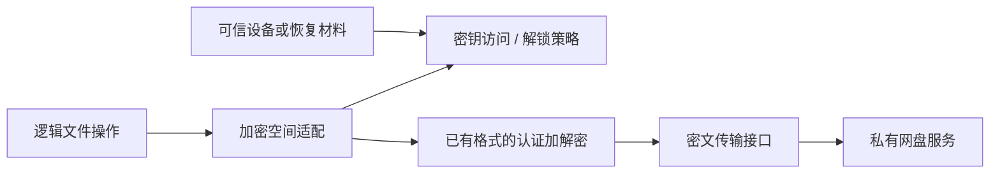

# 05 安全与端到端加密

## 首版与后续边界

NAS 首版即实现凭据保护、账号隔离、传输信任、权限最小化和安全缓存。私有网盘已有 API 与 E2EE 方案，用户会在后续提供资料；本阶段只确定应用侧安全边界和验收要求，不重新定义已有密文格式。

HTTPS、SMB3 传输加密、服务端磁盘加密和端到端加密是不同属性。连接详情使用完整名称，不用一个锁图标暗示服务器无法读取文件。只接入 NAS 的首版不宣称提供 E2EE。

## 威胁模型

| 对手/故障 | 设计目标 | 实际边界 |
| --- | --- | --- |
| 网络窃听/主动篡改 | 校验服务身份，使用加密传输，防止凭据泄漏 | 用户显式选择明文兼容连接时不能提供同等保护 |
| 服务端被攻破/管理员读取 | E2EE 空间的内容、私密名称/元数据不交给服务端明文 | 服务端仍可能知道账号、文件数、密文长度、访问时间和关联结构 |
| 服务器重放旧密文/旧目录 | 验证认证数据和已知 revision；发现可检测回滚 | 仅有 AEAD 无法保证新设备识别全部历史回滚；需已有协议的可信锚点 |
| 手机丢失 | 系统锁屏、Keystore 包装和按策略解锁 | 已解锁/已被高权限控制的客户端不能保证明文不被窃取 |
| 数据库泄漏/日志导出 | 不存明文凭据，敏感字段最少，日志去敏 | 普通非加密空间文件名仍是敏感元数据，按缓存策略保护 |
| 系统重装/密钥失效 | 提供独立恢复流程并明确状态 | 没有恢复材料且没有其他可用设备时可能无法恢复 E2EE 数据 |

## 凭据与本地数据

CredentialStore 是唯一读取密码、refresh token、S3 secret 和必要会话密钥的入口。Connection 中只保存 credentialRef。密文使用成熟 AEAD 实现，以 Android Keystore 不可导出密钥保护；随机 nonce、算法标识和版本与密文一起存储。DataStore / SharedPreferences 本身不等于加密。

不把已弃用的 Jetpack Security Crypto / EncryptedSharedPreferences 作为新工程的默认方案，也不能因为它们被弃用就把密码改存明文。[Android 密码学建议](https://developer.android.com/privacy-and-security/cryptography)、[EncryptedSharedPreferences 状态](https://developer.android.com/reference/androidx/security/crypto/EncryptedSharedPreferences)

支持可用时的硬件 Keystore；不能假定每台设备都有 StrongBox。账号登出清除本地凭据、会话、签名 URL、缓存；停掉关联任务。删除连接只移除本机配置，不删除 NAS 文件。密码变更提升配置 revision，旧任务重新认证，不能继续对更换后的服务器写入。

系统备份明确排除：凭据、Keystore 包装密文、E2EE 材料、上传 token、敏感目录索引、明文缩略图、临时预览和活动任务状态。分别配置 cloud-backup / device-transfer 与旧备份规则，不能只依赖 `allowBackup=false`。可导出的连接设置默认不含 secret；如将来提供凭据导出，采用用户主动加密导出。

Keystore 与用户认证可绑定，但这会影响后台使用；更换生物识别信息等可能使某些密钥永久失效。恢复状态必须是“需要重新登录/恢复密钥”，不能静默生成新密钥覆盖旧密文。[Keystore](https://developer.android.com/privacy-and-security/keystore)、[Auto Backup](https://developer.android.com/identity/data/autobackup)

## 网络信任

HTTP 服务默认要求 HTTPS 和正常主机名验证。自签名 NAS 可提供每连接信任配置：导入专用 CA 或核对证书/公钥指纹后保存信任范围，显示变更并停止自动传输；不能使用 trust-all HostnameVerifier、全局接受所有证书或吞掉 TLS 错误。默认不进行难以维护的公共服务证书钉扎。

若以后需要 HTTP 兼容，在连接设置显式选择并说明凭据/内容可被同网段读取；实现时验证 Android cleartext 策略和 HTTP 客户端是否能按连接准确限制，不能为兼容一台 NAS 全局放开所有地址。

SMB 禁用 SMB1；优先 SMB3，要求可用的签名与加密策略。签名用于完整性，传输加密保护内容；SMB2 没有相同的加密能力时显示真实状态。实际协商结果与预期不符要失败或明确提示，不静默降级。

认证头和 Cookie 不跨未授权 origin 的重定向传播；WebDAV `href` / `Destination` 必须校验目标和根目录范围。私有 API 返回的预签名上传目标单独校验，并且不能自动附带原网盘 Authorization。用户主动配置 LAN 地址是正常用例，不能用简单“禁止所有内网 URL”的规则破坏 NAS 功能。

## Android 权限

| 权限/机制 | 请求时机 | 拒绝或撤销后的行为 |
| --- | --- | --- |
| INTERNET、ACCESS_NETWORK_STATE | manifest 普通权限 | 用于远端访问和网络状态，无额外启动弹窗 |
| ACCESS_LOCAL_NETWORK（Android 17 + target 37） | 首次连接/发现 NAS | 连接等待授权；不误报密码错误 |
| READ_MEDIA_IMAGES / VIDEO | 用户启用持续照片/视频备份 | 保留手动 Picker 上传；如部分授权则缩小范围并提示 |
| READ_MEDIA_VISUAL_USER_SELECTED | 适配用户选择部分媒体的授权状态 | 重新核对可访问集合，不把不可见项当删除 |
| SAF 持久 URI 权限 | 用户选择文件夹来源或保存位置 | 撤销后暂停对应规则，其他连接照常可用 |
| ACCESS_MEDIA_LOCATION | 用户明确需要包含原始位置元数据 | 不影响普通备份，但不能宣称含完整位置元数据的原片 |
| POST_NOTIFICATIONS | 用户首次启动持久传输/备份时说明用途 | 保留应用内进度，按具体 job/FGS 规则测试通知行为 |
| RUN_USER_INITIATED_JOBS | manifest，使用 UIDT 时 | 合法调用仍要满足系统启动条件 |

首版不申请 MANAGE_EXTERNAL_STORAGE，也不为文件管理申请通讯录、麦克风或相机。具体 manifest 以选用 API 和目标系统文档核对；UI 说明紧贴触发动作。[存储权限](https://developer.android.com/training/data-storage/shared/media)、[局域网权限](https://developer.android.com/privacy-and-security/local-network-permission)、[UIDT 声明](https://developer.android.com/develop/background-work/background-tasks/uidt)

## E2EE 应用层边界

文件浏览与同步面向解密后的逻辑条目；加密空间实现层负责名称、元数据、内容和偏移映射。Provider 上暴露 `VaultAccess` / `EncryptedNamespace` 能力，内部既可适配已有端到端格式，也可组合已有协议的密文传输；不要求其等同于简单的 HTTP 拦截器。

原则是：解密完成并通过相应认证后才将明文交给预览；上传前完成加密，服务端只收到允许公开的字段和密文。不要将明文 SHA-256、文件名、EXIF、可识别缩略图作为方便检索的“额外元数据”交给服务器；即使数据正文已加密，这些也可能泄漏信息。

## 收到已有方案后必须核对

| 方面 | 必须能够回答 |
| --- | --- |
| 密钥层级 | 哪个密钥解密空间/目录/文件；文件版本是否隔离；哪些密钥可以轮换 |
| 恢复 | 新设备怎样从恢复材料或可信设备恢复；服务端密码重置是否影响数据 |
| 多设备 | 新设备公钥如何验证，服务器能否替换公钥骗取密钥；撤销后的权限边界 |
| 内容格式 | 算法、nonce 管理、分段边界、认证标签、格式版本与跨端测试向量 |
| 元数据 | 名称、MIME、长度、目录关系、时间戳和缩略图哪些已加密，哪些公开 |
| 随机读取 | 如何将明文 offset 映射成密文 range；段/最终长度如何认证 |
| 更新/移动 | 重命名是否需重加密；文件关联数据是否绑定不稳定路径 |
| 重传 | 重启后如何避免 nonce 重用；断点必须复用原密文还是重新生成整个对象 |
| 回滚 | 怎样发现旧版本替换、截断、重排和不完整目录；新设备的信任依据是什么 |

如果已有协议未覆盖某一项，形成差距和能力限制，再决定是否扩展；不要先实现自创 AES 分块格式以便“以后兼容”。

参考选项是成熟流式 AEAD 实现，而非自行设计密码算法。Tink Streaming AEAD 提供分段认证及局部解密能力，但不能据此假设可以任意续接加密过程；已有密文改变通常要求重加密。具体是否能用于既有网盘，必须先证明 wire format 兼容。[Tink 大文件加密](https://developers.google.com/tink/encrypt-large-files-or-data-streams)、[流式 AEAD](https://developers.google.com/tink/streaming-aead)

若采用整流格式，应选择“持久化同一份密文后续传”或格式明确支持的恢复方式；不能重新调用随机加密再从中间拼接旧密文。密文暂存成本必须进入磁盘预算。若已有网盘是独立分段格式，段身份、文件版本、顺序、总长度/最终段认证也必须由该协议验证。

## 锁定与自动备份的取舍

“每次使用密钥都要用户解锁”与“锁屏期间无人值守解密/加密”不能同时无条件保证。提供明确策略，默认高保护模式：

| 模式 | 后台备份 | 风险/限制 |
| --- | --- | --- |
| 需要用户解锁 | 锁定时排队；只处理密钥授权有效期间的任务 | 最简单、明确，不能保证夜间无人值守上传 |
| 后台可用密钥 | 用户主动开启，受设备与 Keystore 策略保护 | 不等于每次操作都要求生物识别；设备已解锁/受控时暴露面更大 |
| 仅加密上传能力 | 仅在既有协议支持且验证通过时启用 | 例如写入端不持解密私钥；不凭空假定它支持目录读取和去重 |

设备重启首次解锁前不要求备份执行；采用 credential-encrypted 存储。锁定动作停止新的明文输出、清理内存 key 引用和敏感 UI；JVM 内存无法承诺可靠物理擦除，不能将其描述为绝对清零。

## 加密缓存与外部打开

锁定空间的文件名索引、缩略图、文本摘要不能留在未加密 Room 或磁盘缓存中。优先磁盘只缓存密文，解锁后内存建立有界逻辑视图；如需持久索引，单独使用加密存储并通过兼容性验证，不默认 Room 自带数据库加密。

PDF 等必须使用本地明文临时文件的预览，写入私有且排除系统备份的位置，关闭/超时清理并有崩溃恢复清理流程；加密空间可以禁用这种预览。敏感空间可启用 FLAG_SECURE，普通文件不强制禁止截图。

外部打开相当于将明文交给用户选择的应用；先说明这一点，通过 FileProvider 给单一 URI 的临时读权限。撤销权限不能收回对方已复制的数据。通知默认只显示任务数与连接名，用户可选择是否显示文件名。

## 安全验收

凭据不出现在 logcat、崩溃报告、HTTP tracing、通知、返回栈和导出设置；切换账号不复用旧授权缓存；证书变化停止自动传输；目录遍历/恶意 XML/异常 MIME 无法越界读取本机数据。

E2EE 上线前要求：现有客户端与 Android 的已知向量互通；位翻转、段交换、截断和错误关联数据被拒绝；断点上传不会混合不同密文实例；旧设备删除后可用恢复材料在干净设备恢复样本；错误密码、失效密钥和撤销设备流程有明确结果；服务端观测不到禁止公开的明文/哈希。密码协议审查和恢复演练是上线门槛，不是 NAS 首版的阻塞项。
