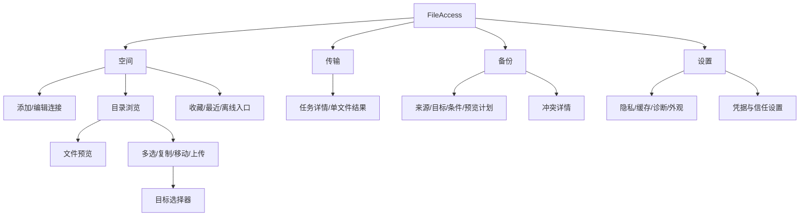

# 06 UI / UX 设计

## 设计方向

简洁的原生 Android 文件界面，以清楚的文件信息和任务状态为主。使用 Material 3 稳定组件、系统动态配色和浅色/深色主题；不引入占据首页的磁盘占用仪表盘。界面语言先简体中文，同时从首日将用户文案放入资源文件。

首页是“空间”，底部导航为 **空间 / 传输 / 备份 / 设置**。本机来源只在上传与备份选择流程出现，离线文件和收藏放在空间页。首版显示 NAS 连接，不显示还未实现的 S3/私有网盘入口。

## 信息架构



## 布局与视觉规范

| 元素 | 规范 |
| --- | --- |
| 布局栅格 | 4 dp 基础间距，常用 8 / 12 / 16 / 24 dp；手机内容左右 16 dp |
| 文本 | 使用 Material typography；文件名主体约 bodyLarge，元数据 bodySmall；跟随字体缩放 |
| 点击区域 | 至少 48 × 48 dp；不依赖长按作为唯一入口 |
| 文件行 | 图标/缩略图 + 名称 + 次要信息 + 更多；名称截断时详情可读完整值 |
| 状态 | 图标 + 文案共同表达；绿色不代替“已完成”，锁图标不代替加密类型说明 |
| 选择 | 行复选框和顶部数量；危险操作与常用预览分开 |
| 进度 | 已传字节/总字节；未知总量时无百分比；速度和 ETA 不稳定时隐藏 |
| 动效 | 简短状态过渡，遵循系统减少动画偏好；无不断播放的装饰动画 |
| 系统集成 | edge-to-edge、正确处理 insets、IME、预测性返回和系统分享 |

根据可用窗口空间而不是设备型号布局。紧凑窗口为单栏+底部导航；中等窗口按内容适用导航栏/rail；扩展窗口采用 navigation rail + 目录列表/预览双栏。窗口宽度类约 600 / 840 dp 是布局起点，最终依据自适应 API、折叠姿态和实际内容调整。平板不可仅把手机 UI 拉宽。[自适应应用](https://developer.android.com/develop/adaptive-apps/guides/get-started-with-adaptive-apps)

## 屏幕规格

### S01 空间

顶部标题“空间”，右侧“添加”；下方是连接列表，每项显示用户命名、协议、最近连接状态。连接卡只在服务实际提供容量信息时显示容量。可设置常用连接，但不自动进入需要认证的远端。

下方为收藏目录、最近访问和离线文件入口。首次无连接时显示“连接你的 NAS”，主按钮“添加连接”，可查看所需主机、共享名或 WebDAV 地址说明。初始化不索取媒体访问权。

### S02 添加连接

步骤：选择协议 → 输入参数 → 测试读取连接 → 选择根目录 → 保存。首版协议选择只有 SMB 和 WebDAV；公共配置表单支持基本字段 schema，特殊认证页面后续通过专属连接流程接入。

| SMB 字段 | WebDAV 字段 |
| --- | --- |
| 名称、主机/IP、端口（高级）、共享、域（可选）、账号、密码 | 名称、HTTPS 地址、账号、密码/token |
| 可选根目录、安全协商策略 | 可选根目录、证书信任配置 |

密码默认隐藏，编辑时不回显完整秘密；“保存密码”影响后台可用性。测试过程中区分 DNS/地址、局域网权限、TLS、登录、共享/目录权限。测试成功文案为“可以读取目录”；自动备份开启时再核对写入能力，不在用户不知情时写测试文件。

### S03 目录浏览

顶部连接名称和面包屑；操作区有当前目录搜索、排序、列表/网格切换。首屏显示已有缓存时标记更新时间，后台刷新失败不清空列表。

点击文件夹进入，点击文件预览。更多菜单包含详情、下载、复制、移动、重命名、删除，按能力和条目权限启用；不支持的关键功能在详情解释原因。长按进入多选，也提供菜单“选择项目”。

目录搜索默认仅当前目录；尚未完整列出时显示“搜索已加载项目”。想搜索子目录需要明确选择并可取消，不把本地缓存搜索伪装成全局远端搜索。

多选进入上下文工具栏，显示“已选 N 项”。目标选择器必须展示目标连接和完整面包屑，并禁止移动到自身子目录。跨连接操作在后续版本提示经手机中转及是否跨越加密边界。

```text
┌──────────────────────────────┐
│ ‹ 家庭 NAS                 ⋮ │
│ 文件 / 照片 / 2026           │
│ 搜索当前目录            排序 │
│ ▣ 九月旅行             18 项 │
│ ▣ 相机备份                   │
│ ▧ IMG_0912.jpg   4.2 MB    ⋮ │
│ ▷ 海边.mp4      1.8 GB    ⋮ │
│                              │
│                   ＋ 上传    │
│ 空间    传输    备份    设置 │
└──────────────────────────────┘
```

### S04 预览

图片默认适合屏幕，可双指缩放，完整文件名和元信息在详情；视频显示播放/暂停、时间轴、音量系统行为和“缓存后播放”的降级状态；不强求所有 NAS 视频都能即开即播。

文本显示编码和截断提示；PDF 分页渲染；未知格式显示类型、大小、“下载”及“用其他应用打开”。请求下载前若需要较大临时空间，先显示预估与可用空间。播放错误给出“格式不支持”“读取中断”“文件已变化”等准确原因。

锁定的加密空间只显示解锁入口和允许公开的信息；解锁后才暴露私密名称/缩略图。外部打开加密文件时明确说明将导出明文。

### S05 传输中心

筛选为“进行中 / 需要处理 / 已完成”。每个任务显示方向、来源/目标、文件名、字节进度和状态，点开可看校验等级、恢复方式、失败原因及单文件结果。暂停与继续一对一切换，取消与重试分开。

正在发数据到 100% 后仍可能“正在验证”“远端提交中”，不能提前显示成功。长时间等待要显示“等待 Wi-Fi”“等待系统安排”“需要重新登录”，不能只显示旋转图标。

```text
┌──────────────────────────────┐
│ 传输                         │
│ 进行中  需要处理  已完成      │
│ ↑ 海边.mp4                   │
│ 家庭 NAS / 视频              │
│ ━━━━━━━━━░░░  640 MB / 1.8 GB │
│ 正在上传                 暂停 │
│                              │
│ ↑ IMG_0912.jpg               │
│ 等待 Wi-Fi                   │
│ 空间    传输    备份    设置 │
└──────────────────────────────┘
```

### S06 备份首页

每条规则独立显示：来源→目标、状态、上次检查、上次成功、待上传数量和是否有未访问来源。主按钮“立即备份”，菜单可暂停、编辑或删除规则。删除规则仅删除规则与本地任务记录，保留已备份远端文件，并在确认说明中写清楚。

全部完成文案使用“本轮已授权范围内的文件已备份”，而非“手机所有照片已安全”。首次未扫描时用“尚未检查”，不能用绿色勾号。

### S07 新建/编辑备份规则

1. 来源：相机照片/视频或用户授权目录，展示完整/部分/失效权限。
2. 目标：已配置 NAS 和目录，显示可用写能力及空间信息（如已知）。
3. 范围：是否包含历史媒体、类型和命名归档规则。
4. 条件：仅 Wi-Fi、仅非计费网络、仅充电、低电量暂停；每项说明触发含义。
5. 复核：数量和总量预估、冲突保留方式、删除语义；按钮“启用备份”。

“本机删除后，远端副本仍保留”常驻显示。后续双向同步不是一个难以察觉的小开关，而是单独模式选择并展示传播方向。

### S08 冲突

显示本机与远端两列摘要：名称、大小、修改时间、版本/校验可用性，动作是“保留双方”（默认）、“保留本机版本”“保留远端版本”“稍后处理”。批量应用决议只影响当前清单，不静默变成永久规则。提交决议时再次核对版本，变化则刷新比较。

### S09 设置与连接详情

设置分为外观、网络与备份默认条件、缓存与离线、隐私与安全、诊断、关于。诊断默认本地保存、去敏；导出前用户能预览内容。没有广告、推荐服务、订阅和无关新闻。

连接详情显示真实协议版本、传输保护、支持能力、最后探测时间；后续加密空间设置提供解锁策略、恢复状态和可信设备入口，不把密码或恢复材料直接列在设置列表中。

## 完整主流程

首次配置 NAS：打开空间 → 添加 SMB/WebDAV → 输入连接 → 需要时申请局域网权限 → 测试 → 选择根目录 → 保存 → 浏览 → 打开样本文件。

首次备份：备份页 → 新建规则 → 选择媒体/目录并授权 → NAS 目标 → 条件 → 扫描预估 → 启用 → 查看任务 → 完成后可跳转远端文件。

失败恢复：通知/传输页看到具体等待原因 → 修复网络/权限/认证 → 核对 checkpoint → 自动或用户继续 → 服务提交确认 → 更新本轮备份结果。

## 异常与文案表

| 情况 | 页面反馈 | 下一步 |
| --- | --- | --- |
| 空目录 | “这个文件夹还没有文件” | 上传/新建文件夹 |
| 有缓存但 NAS 离线 | “显示上次读取的内容 · NAS 暂时不可达” | 重试；禁用不能离线完成的操作 |
| 局域网权限拒绝 | “需要局域网访问权限才能连接家庭 NAS” | 在用户操作后重新申请/打开设置 |
| 部分媒体授权 | “当前只能备份你允许访问的照片和视频” | 管理授权范围 |
| 普通 DAV 上传中断 | “此服务器不支持断点上传，需要重新上传” | 重新开始/保留暂停 |
| 提交响应丢失 | “正在确认服务器是否已保存文件” | 自动核对；无法确认再请求处理 |
| 文件冲突 | “目标中有同名但不同内容的文件” | 保留双方/查看比较 |
| 加密锁定 | “等待解锁加密空间” | 解锁；不反复触发后台弹窗 |
| 磁盘空间不足 | “预览需要更多本机空间” | 清理缓存/取消/其他方式打开 |
| 永久删除 | “永久删除 N 项？此服务器不支持恢复。” | 明确确认/取消 |

仅可恢复的回收站删除显示“撤销”；服务器不提供回收站时不能用 Snackbar 撤销承诺。批量递归删除先解析实际范围并显示结果，服务端未列完整时不能假装只删已见的几个条目。

## 无障碍和状态保存验收

TalkBack 能读到文件名、类型、选择状态、进度和错误动作；装饰图标不重复朗读。旋转和窗口改变保留当前目录、排序、滚动位置与小范围选择；大量目录信息从仓库恢复。后退优先退出选择/关闭预览，再返回父目录，顶层切换保留各自导航状态。

至少覆盖 320 dp 紧凑窗口、常见手机宽度、平板双栏、200% 字体、深色、键盘、中文长文件名和混合语言名称。确认按钮不能被键盘遮挡，重要状态不能只靠颜色表达。

## 交互草案说明

本轮另提供可切换“空间 / 传输 / 备份 / 设置”的手机交互草案，用示例 NAS 和文件展示布局、目录进入、暂停/继续和备份设置。所有数据均为演示，不进行真实连接或文件操作；HTML 仅用于设计评审，正式应用仍用原生 Compose 实现。加密与未来协议完整流程以本设计规格为准，不假装在首版草案中已可用。
