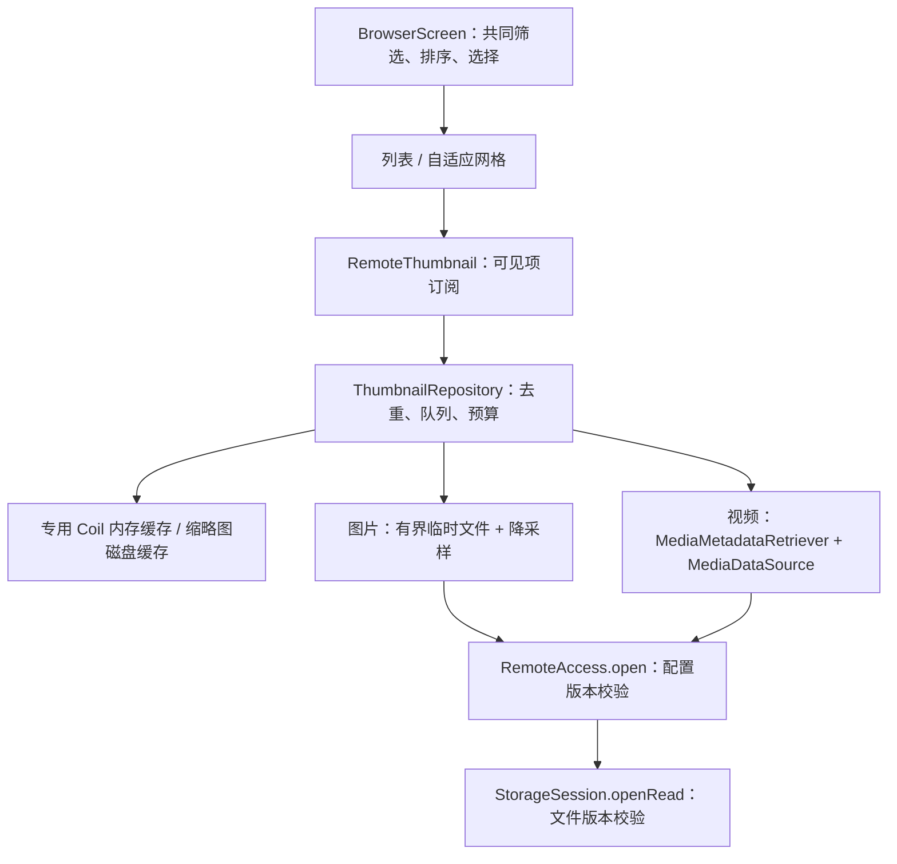

# 媒体缩略图与网格视图：功能设计和实施方案

日期：2026-09-13。状态：待评审方案，尚未实现或进行性能验收。

基线：`c0de6e4`。独立分支：`design/media-thumbnails-grid`；工作树：`D:/Android/AndroidStudioProjects/FileAccess-media-grid`。本次交付设计，后续由功能实现提交落地，再交给专门负责合并的 agent 集成。

## 1. 目标与范围

用户在 SMB 目录中能直接辨认照片和视频，通过列表／网格切换找到媒体，并继续使用已有的打开、下载、选择、重命名、删除操作。目录先显示文件信息，缩略图渐进出现，单项加载失败不影响目录可用性。

| 本期包含 | 后续考虑 |
| --- | --- |
| 列表中的图片／视频小缩略图；网格中的大缩略图 | 独立相册、时间线、递归媒体索引 |
| JPEG、PNG、WebP；HEIF/HEIC 等由设备解码能力决定 | RAW、SVG、音频内嵌专辑封面、PDF 首页面 |
| 视频静态封面，成功获取时显示时长；动画图片只显示静态帧 | 视频悬停播放、动态缩略图、幻灯片 |
| 混合目录统一网格；文件夹、音频及其他文件显示类型图标 | 文件夹拼贴封面、手势调整列数 |
| 全局视图偏好持久化、内存／磁盘缓存、取消和失败降级 | 按目录记忆视图、后台批量生成、NAS 专有缩略图服务 |

没有 NAS 缩略图接口时，图片生成可能需要读取完整的压缩原文件；本方案限制单项及累计读取，不承诺所有媒体都能低成本生成封面。缩略图无需新的本机照片权限，沿用用户已配置的 SMB 连接和现有网络授权。

## 2. 现有代码约束

| 位置 | 当前事实及设计影响 |
| --- | --- |
| `app/.../ui/Screens.kt::BrowserScreen` | 只有 `LazyColumn`；筛选、文件夹优先排序、选择和操作菜单均在这里。两种布局必须消费同一份排序结果和选择集合。 |
| `MainViewModel.kt::BrowserState/loadDirectory` | 每 100 条发布一次列表；全部完成才设置 `complete`；加载时会将 directory 清空。缩略图不能等待整个目录结束，也不能用临时为 null 的 directory 作为恢复状态的唯一键。 |
| `preview/PreviewRepository.kt::cachedFile` | 整文件下载，上限 128 MiB，共享 Mutex 串行，预览缓存 256 MiB；缓存键没有连接配置 revision。网格不直接调用它。 |
| `preview/RemoteMediaDataSource.kt` | 这是 Media3 的顺序／seek 数据源，不是 Android `MediaDataSource`，不能直接传给 `MediaMetadataRetriever`。 |
| `StorageSession.openRead` | 已支持 offset 与 expectedRevision；SMB 已声明 rangeRead。无需新增上传、列表或协议能力接口。 |
| `RemoteAccess.open` | 已支持 expectedConfigRevision；`withSession` 没有该参数，新缩略图读取使用 `open(id, revision).use`。 |
| `ConnectionRepository.save` | 保存配置／凭据会递增 revision。缩略图请求必须绑定产生目录快照的配置版本，防止旧路径被用于新共享。 |
| `SettingsRepository` / `AppSettings` | 已有 DataStore 与 Hilt provider，可新增独立偏好键；不需要 Room schema 迁移。 |

准确实现边界见 [现有实现记录](../implementation-status.md)，原始产品与缓存方向见 [架构设计](02-architecture.md) 和 [UI/UX](06-ux.md)。本方案中的预算是本功能拟采用的值；不代表已调整全应用缓存预算。

## 3. 交互设计

默认保留列表。目录工具栏在排序按钮旁增加视图切换按钮，描述为“切换为网格”／“切换为列表”；点击立即生效，并异步保存全局偏好。无需根据媒体比例自动改变布局。

网格用等宽卡片：正方形预览区、两行文件名、一行次要信息；视频左下角显示视频标记，时长仅在取帧时顺带读取成功后显示。文件夹和非媒体用相同占位尺寸的类型图标，保留文件夹优先顺序。卡片右上角保留更多菜单；选择模式用勾选标记与边框，缩略图仍可见。

```text
照片                         [刷新]
[ 搜索当前目录          ] [排序] [列表]
42 项                       [上传] [新建] [备份]
┌──────────┐ ┌──────────┐ ┌──────────┐
│  文件夹 ⋮│ │  照片  ⋮│ │  封面  ⋮│
│          │ │          │ │ ▷ 00:32 │
└──────────┘ └──────────┘ └──────────┘
旅行          IMG_0421.jpg  VID_0422.mp4
文件夹        3.2 MB        24 MB
```

这是结构示意，列数由实际宽度决定。实现采用 `LazyVerticalGrid(GridCells.Adaptive(104.dp))`，两侧 16 dp、间距 8 dp：360 dp 宽度约 3 列。字体放大时将最小宽度提升到 136 dp，文件名区域允许增高；宽屏沿用页面最大宽度 1100 dp。Compose 的自适应网格和全宽 item 可直接支持这一布局。[官方布局说明](https://developer.android.com/develop/ui/compose/lists)

列表预览区 48 dp；网格预览区 1:1，居中裁切，原文件保持不变。缩略图未就绪时用静态类型占位图，避免每个格子显示转圈。加载失败保留类型图标和可访问状态“缩略图不可用”，卡片仍能打开原文件。全局计费网络或预算暂停在内容区顶部用一条提示，并提供“加载缩略图”／“继续加载”操作；不为每项弹 Snackbar。

单击打开、长按选择、选择模式单击切换勾选，与列表一致。更多菜单复用已有权限和 busy 判断；删除仍走已有确认框。下载按钮不被封面加载状态阻塞。辅助功能提供文件名、类型、选中状态及菜单描述；交互目标至少 48 dp，不只靠颜色表达选择。

列表／网格切换保留筛选、排序和选中项，不重新请求目录。以首个可见文件的稳定键作为切换锚点，在目标布局中定位对应文件；两种布局各自记住滚动偏移，首次切换不复用不兼容的像素偏移。改变筛选／排序回到首项。进入新目录清空筛选和选择；返回父目录／从预览返回恢复原锚点与筛选。筛选时保留隐藏项的选中状态，计数包含全部选中项，删除确认继续列出实际目标。

状态按导航 `Browse(connectionId, opaqueId)` 保存；序列化 EntryRef 为两个字符串，禁止直接把非可保存对象写入 SavedState。刷新沿用导航目录键；列表完整刷新后剔除已不存在的选中项，部分列表失败时不误删选择。目录错误、空目录、无筛选结果、未完整加载提示在网格中占整行，文件名和占位图始终先于网络封面可用。

## 4. 实现结构和接口边界



业务保持在 app 层，先新增 `app/.../thumbnail/` 和 `app/.../ui/browser/` 包，无需创建新的 Gradle 模块。Hilt 提供单例 Repository 和专用 Coil ImageLoader；在导航入口装配，保持 `BrowserScreen` 可通过假的缩略图内容独立测试。

拟议契约（伪代码，具体 Coil 扩展签名在编码时按锁定版本编译核对）：

```kotlin
enum class BrowserViewMode { LIST, GRID }

data class ThumbnailRequest(
    val entry: RemoteEntry,
    val connectionRevision: Long, // 来自目录快照，不在 UI 猜测当前值
    val edgePx: Int,              // 物理像素，规范化为 128 / 256 / 512
    val refreshEpoch: Long,       // 无可靠版本时的浏览会话标识
)

// bitmap/file 由 app 缩略图层持有，禁止进入 BrowserState 或 SavedState。
// UI 只观察 Loading / Ready / Unavailable(reason)；取消不转成失败。
interface ThumbnailRepository {
    fun observe(request: ThumbnailRequest): Flow<ThumbnailState>
    suspend fun invalidateConnection(connectionId: String)
    suspend fun invalidateEntry(ref: EntryRef)
    suspend fun clearCache()
}
```

`BrowserState` 尾部增加可空 `connectionRevision`（带默认值避免破坏当前位置参数测试）。`loadDirectory` 先获取连接 revision，再用 `remote.open(connectionId, revision)` 建立该目录的会话，条目与该 revision 一起发布。页面请求携带相同 revision；配置变化时使旧目录状态失效并刷新，不能把旧 entries 与新 revision 拼接。

新增 `BrowserContent` 仅负责布局分派，`FileRow`、`FileGridItem` 共用缩略图组件、条目菜单和操作回调。稳定 item key 使用无歧义编码后的 connectionId 与 opaqueId；内容缓存另包含文件版本。将现有筛选排序逻辑抽为纯函数，避免两份逻辑漂移。

`AppSettings` 增加 `browserViewMode`，DataStore 新增 `browser_view_mode`，缺省／非法值回退 LIST。新增 `media_thumbnails_unmetered_only`（默认 true）及设置入口；只限制自动缩略图读取，不改变预览或传输策略。偏好未读出前可先展示列表，读出前用户已主动切换时应以用户动作优先，避免迟到的数据覆盖。写入失败保留当次选择并给出一次保存失败提示。

## 5. 图片和视频生成

### 图片

按 MIME 分类，MIME 缺失或为通用二进制类型时按扩展名回退；扩展名使用 `Locale.ROOT`。不把“可尝试解码”视为保证支持。目录和音频等非目标文件在排队前返回类型图标，零网络开销。

缓存未命中时，用版本固定的 SMB 会话将图片写入 `cacheDir/thumbnails/tmp`，边读边检查取消、单项字节和目录预算；禁止先完整读入 ByteArray。已知大小超过 16 MiB 直接降级；大小未知最多尝试 16 MiB 加一个探测字节并在超限时删除临时文件。完成后验证已知长度和远端 revision。

通过 Coil 的本地文件请求按目标物理像素尺寸降采样，处理 EXIF 方向，仅解码静态帧；不注册动画播放 decoder。生成最长边不超过请求档位的缩略图，交由 UI 居中裁切。透明图保留 alpha，其他图可编码为 JPEG；去掉原图 EXIF、GPS 等元数据。原图临时文件在成功、失败、取消时均清理。Coil 显示层采用 `AsyncImage` 或显式尺寸的 painter，避免默认原尺寸解码及网格内不必要的 subcomposition。[Coil Compose 文档](https://coil-kt.github.io/coil/compose/)

### 视频

新增 `RemoteThumbnailMediaDataSource : android.media.MediaDataSource`，与现有播放数据源分离。单次取帧持有独立 StorageSession；`readAt(position, ...)` 对连续读取复用流，seek 关闭旧流并以 offset 重新 `openRead`，每次传 expectedRevision。用同步保护读位置，close 幂等，关闭流和会话；负数位置、越界 buffer、零长度、EOF、短读必须按 API 契约处理，offset／长度用 Long 且避免加法溢出。禁止用从头 skip 模拟 seek。[MediaDataSource 契约](https://developer.android.com/reference/android/media/MediaDataSource)

首版要求 rangeRead、已知非负长度及非空 revision；不满足时显示视频图标。`MediaMetadataRetriever.setDataSource` 后读取时长，选择 `min(1 秒, 时长 / 2)` 附近的同步帧；未知时长尝试 0 秒，用 `getScaledFrameAtTime(..., OPTION_CLOSEST_SYNC, edgePx, edgePx)`。返回 null 或设备不支持时降级，时长仍可单独显示。旋转元数据与输出方向通过横竖视频实测，避免重复旋转。[取帧 API](https://developer.android.com/reference/android/media/MediaMetadataRetriever)

给数据源配置 256 KiB 分块、最多 2 MiB 内存块缓存；单次取帧读取上限 8 MiB、非连续 seek 上限 32 次。数据源每次真正读底层流前预留预算，按实际读取结算，重复网络读取也计费。MP4 索引可能在尾部，允许直接 seek 到末尾；越过预算则降级，不回退整视频下载。取帧后再次校验 revision，最后释放 retriever、数据源及会话。

取帧在独立的单工作线程执行；10 秒为停止继续读数据的软时限，不承诺强制中断平台原生解码。现有 SMB 操作／socket 超时为 30／35 秒，不能只加 `withTimeout(10s)` 就宣称实际资源已释放。取消时使数据源关闭并拒绝后续读取，取消排队请求、丢弃迟到结果；仍在执行的工作必须继续占用并发槽，直到真实释放。若设备测试发现原生调用长期不返回，发布前改为可终止的隔离进程方案，或明确停用该设备的视频自动封面，不能无限增加线程绕过阻塞。

## 6. 调度、网络与缓存

| 项目 | 初始策略（待测参数） |
| --- | --- |
| 加载窗口 | 可见项优先；停滚后最多预取下一行；快速滚动时不启动预取 |
| 队列和并发 | 待执行队列最多 64 项；总生成并发 2、每连接 1；视频最多 1；超出窗口丢弃排队请求 |
| 请求去重 | 相同内容键共享一次生成；独立订阅计数，最后订阅离开才取消，取消一个格子不影响另一个 |
| 前后台 | 页面不可见、进入全屏预览或 App 退后台时停止预取并取消无人订阅任务；不建立 WorkManager／传输任务 |
| 自动网络 | 默认仅非计费网络；命中缓存不依赖网络；计费网络允许在当前目录显式加载一次，不修改全局设置 |
| 累计读取 | 每个导航目录浏览会话自动预算 64 MiB；刷新不重置，返回恢复该会话预算；用户“继续加载”增加 64 MiB |
| 内存 | 专用 ImageLoader 的 bitmap 缓存上限 `min(32 MiB, 应用最大堆 / 8)`；临时 bitmap 和视频块缓存另计峰值 |
| 磁盘 | 持久缩略图 128 MiB LRU，7 天 TTL；在途图片临时空间预留最多 32 MiB，生成前保留至少 512 MiB 空闲 |
| 总量边界 | 现有预览预算 256 MiB 保持；本功能增加最多 128 MiB 成品和 32 MiB 在途文件，不计传输 staging |

队列由 viewport 的稳定键集合驱动，不能只依赖“Composable 已进入组合”来判定可见，否则 Compose 预组合可能触发无界预取。一个请求不得同时重复占据多个槽位。会话预算并发预留、原子结算；命中内存／磁盘不计网络预算。计费判定来自 Android 网络能力，不能拿“Wi-Fi”当作非计费，也不能要求公网验证成功才能访问局域网 NAS。

内容键使用版本化、无歧义序列化后 SHA-256：`schemaVersion + connectionId + connectionRevision + opaqueId + entry.revision + size + modifiedAt + mediaKind + edgeBucket + framePolicy + orientationPolicy`。哈希只用于索引，不构成加密。列表允许复用同版本更大档位结果，网格可先显示小图再升级；切换不强制重复远端读取。

revision 缺失时只能在当前 refreshEpoch 内命中内存，不持久缓存；已知 revision 在 TTL 内可命中磁盘，显式“重新加载缩略图”可绕过该条目缓存。SMB revision 是元数据，不保证能识别同大小、同时间的替换；此限制沿用现有协议并在实现记录中说明。

持久缓存采用成品文件 + 最少 sidecar 元数据，临时编码后原子发布。LRU 更新和清理用短锁，不把网络／解码包在全局 Mutex 中；读取有租约，避免清理正在被 Coil 解码的文件。专用 Coil 层不再建立一份重复的磁盘缓存。损坏缓存删除后至多重新生成一次；启动时清理崩溃遗留的 `.part`，有界维护索引。所有字节／空间计算使用 Long。

缓存查询前校验当前连接仍存在且 revision 匹配；监听连接配置变化取消旧任务并清除对应磁盘和内存。编辑／删除连接、权限失效均使相关命中失效；发布缓存前再次核对配置及缓存 generation。重命名／删除成功使旧 EntryRef 的所有档位失效；“清除缩略图缓存”先递增 generation 并取消旧任务，再清理，防止迟到任务回写。连接移除／账号更换立即卸载 UI 中已显示图片。服务端撤权只能在下一次访问获得错误后感知，不承诺离线期间实时检测。

缓存是应用私有明文，不写到相册或共享目录，不记录真实路径、文件名、NAS 地址及凭据到诊断日志。沿用应用禁止系统备份的设置；缓存清理不能触碰预览外的离线文件或上传 staging。

## 7. 错误与重试

| 条件 | 行为 |
| --- | --- |
| 不支持、损坏、超单项预算 | 类型图标；当前版本记忆结果，防止滚出滚入反复读取；菜单允许显式重试，但单项硬上限不变 |
| 网络失败 | 同连接短暂熔断 30 秒；不逐格自动重试，目录级一个重试入口；重试不重置累计字节预算 |
| 认证／权限失败 | 取消该连接队列，清缓存并停止自动尝试；一次提示检查连接／权限 |
| 文件不存在／SOURCE_CHANGED | 不发布结果；使旧图失效，提示刷新目录，不以旧 metadata 连续重试 |
| 空间不足 | 清理可淘汰缓存；仍不足则图标降级，目录和原文件操作保持可用 |
| 取消／连接版本变化 | 不转为普通失败、不缓存失败、不弹错误；禁止迟到图片绑定到新的格子 |

负缓存有容量上限 512 项，不写入 Room；网络类到期后仍需新的可见请求才重试，格式类在版本变化、离开浏览会话或用户明确重试时清除。

## 8. 落地顺序与合并边界

| 阶段 | 交付与完成条件 |
| --- | --- |
| M1：网格和共用状态 | 新组件、共享菜单、列表／网格切换、偏好与滚动恢复；先用类型图标，既有删除确认测试仍通过 |
| M2：图片管线 | 分类、请求去重、缓存、尺寸／方向、空间与网络预算、取消；列表和网格接同一组件 |
| M3：视频管线 | Android MediaDataSource、有限范围读和取帧、时长、取消实测；标准 H.264 MP4（索引前置／后置）必须成功，不能以全部降级代替完成 |
| M4：集成验收 | 配置变更与文件操作失效、网络异常、Compose 回归、Android 16 媒体矩阵、文档和脱敏截图 |

预计实现需要 4–6 个开发工作日，其中视频和真实 SMB 验证占 1–2 日；这是规划估计，不是已测工作量。M1、M2 可独立审查，功能完整验收包括 M3、M4。

| 文件区域 | 实现阶段拟修改内容／合并建议 |
| --- | --- |
| 新增 `app/.../thumbnail/*` | Repository、Key、Policy、Cache、分类和视频数据源；主要功能集中在新文件 |
| 新增 `app/.../ui/browser/*` | BrowserContent、FileRow、FileGridItem、RemoteThumbnail、共用菜单与 UI 状态；避免大范围格式化 Screens.kt |
| `ui/Screens.kt` | 将现有 BrowserScreen 条目区委托新组件，保留其余页面；若并行 UI 分支也抽取浏览页，合并 agent 统一最终归属 |
| `MainViewModel.kt`、`ui/FileAccessApp.kt` | 目录快照配置版本、导航稳定键、偏好与缩略图装配、文件操作失效；这是主要共享冲突点 |
| `core/data/.../SettingsRepository.kt`、`DataModels.kt` | 新增偏好字段和键；保留其他分支增加的设置，不替换整个文件 |
| `ui/Screens.kt::SettingsScreen` 或后续设置组件 | 视图／自动缩略图偏好与清理入口；与设置工作统一接线 |
| 新增 `res/values/media_strings.xml` | 所有本功能文案用 `media_` 前缀，减少共用字符串文件冲突 |
| 新增 app JVM／Android 测试文件 | 使用生成媒体和假存储；复用已有 ScreensTest 做回归，不改传输测试语义 |
| Gradle、协议／传输／数据库 | 方案优先使用现有 Coil、Coroutines 和平台 API；不更新版本、不修改上传能力或 Room schema；如果实装需新增 artifact，单独审查 catalog 和校验元数据 |

本设计提交仅新增本文件，避免与并行工作共同改设计入口。合并 agent 可单独 cherry-pick 设计提交；功能完成后再在设计入口和实现记录添加准确链接及验收结果。无需合并或回写其他工作树，不将本方案中的“待实施”描述更新为已完成。

## 9. 验证和验收门槛

| 层次 | 必须验证的用户结果／不变量 |
| --- | --- |
| JVM：请求与缓存 | 跨连接／账号 revision／文件版本不串图；键无歧义；并发去重和最后订阅取消；清缓存后迟到结果不可写入；TTL/LRU/损坏文件/空间不足；负缓存容量与预算并发不超限 |
| JVM：远端读取适配层 | 假 StorageSession 记录 offset／expectedRevision；连续／随机读、短读、EOF、超过 2 GiB 的 offset、seek／读取预算、连接变化、异常关闭；Android 回调薄层放设备测试 |
| Compose | 两种布局操作等价；切换保留筛选／选中与锚点；菜单／明确删除确认；刷新／旋转／预览返回恢复；部分目录错误全宽且仍可操作；缩略图失败仍可打开文件 |
| Android 解码 | JPEG EXIF 1–8 方向、透明 PNG、WebP、静态 GIF、设备支持的 HEIC；超大／损坏图；H.264 MP4 头尾索引、竖屏和短视频，H.265／不支持编码有明确降级 |
| Android 资源 | 离屏和退后台取消、断网恢复、计费网络零自动读取、清缓存并发、连接编辑／删除后立即撤图；反复浏览内存无持续增长，流／会话最终回到零 |
| SMB 集成 | 仅隔离共享；证明首屏生成、再次进入命中缓存、视频随机读不整文件下载、读取中源变化、权限失败；计数 read 字节和句柄峰值 |

性能验收使用生成的 1000 项混合目录和 10000 项元数据目录，记录 Android 16 设备型号、分辨率、内存、网络 RTT／吞吐、样本大小和编码、冷／热缓存。10k 用例只评估此功能增量，现有列表全量驻留内存的分页问题另行处理。

目标：目录快照到占位内容不等待任何缩略图；60 Hz 设备滚动帧时间 p95 ≤ 32 ms；在局域网 RTT ≤ 10 ms、吞吐 ≥ 50 Mbps、JPEG 每张 ≤ 2 MiB 的规定 fixture 下首个冷图片缩略图 ≤ 2 秒；热内存命中无需网络。统计生成并发、字节预算、缓存体积与句柄关闭必须满足第 6 节硬边界。以上是待测目标，视频时限是软限制，性能失败必须记录原因和后续决策。

实现后运行：

```powershell
.\scripts\build.ps1 :app:testDebugUnitTest :core:data:testDebugUnitTest :app:assembleDebug :app:lintDebug --console=plain
.\scripts\build.ps1 :app:connectedDebugAndroidTest --console=plain
```

真实 SMB 测试额外按 [开发说明](../development.md) 配置隔离服务参数；未配服务的跳过不算通过。交付包含两种布局的脱敏截图、媒体矩阵和性能记录。当前设计交付只做文档检查，不运行构建、不声明功能或设备测试通过。
